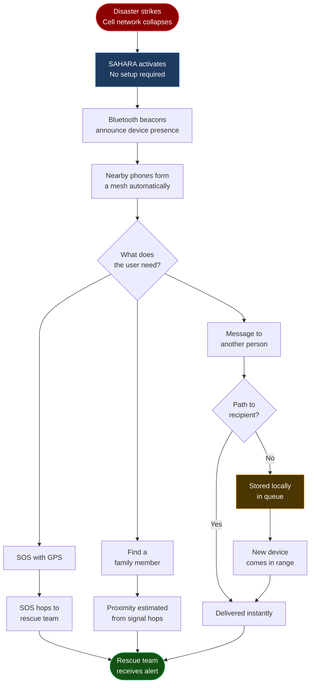
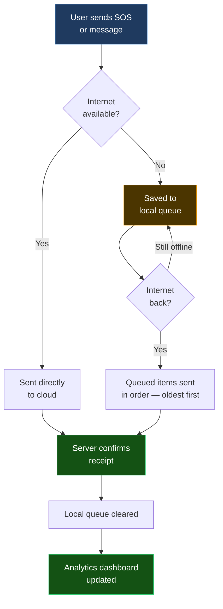

<div align="center">


# SAHARA — सहारा

**Offline Emergency Communication & Disaster Relief Network**

*From the Hindi सहारा — meaning support, refuge, and help.*

[](https://github.com/angelverman2021-a11y/sahara/actions)
[](LICENSE)
[](https://github.com/angelverman2021-a11y/sahara)
[](https://flutter.dev)
[](https://dart.dev)
[](https://python.org)
[](https://github.com/angelverman2021-a11y/sahara)

<br/>

**[Why It Exists](#the-problem--solution)** &nbsp;|&nbsp;
**[4 Features](#4-core-features)** &nbsp;|&nbsp;
**[How It Works](#how-it-works)** &nbsp;|&nbsp;
**[Tech Stack](#tech-stack)** &nbsp;|&nbsp;
**[Cloud Sync](#cloud-sync--api)** &nbsp;|&nbsp;
**[Quick Start](#quick-start)** &nbsp;|&nbsp;
**[Team](#contributors)**

</div>

---

## What is SAHARA?

When a disaster strikes, cell towers go down first — exactly when people need help most. SAHARA turns every smartphone into a relay point, forming a communication network from the phones themselves. No tower. No SIM. No internet.

---

## The Problem & Solution

```
NORMAL NETWORK — FAILS IN A DISASTER
──────────────────────────────────────────────────────────────
  Cell tower  →  overloaded  →  offline  →  area blacked out
      │
      ▼
  Calls drop. SMS fails. Rescue cannot find you.

SAHARA — WORKS WITHOUT ANY INFRASTRUCTURE
──────────────────────────────────────────────────────────────
  Your phone  →  Nearby phone  →  Another phone  →  Rescue team
               (relay, auto)     (relay, auto)

  No tower needed. No internet. No SIM. Phones are the network.
```

| Normal Network | SAHARA |
|---|---|
| Needs cell towers | No towers — phones connect directly |
| One tower down = area goes dark | No single point of failure |
| Requires SIM + data plan | Works with no SIM, no data |
| Messages drop when congested | Messages hop until they arrive |
| Location sharing needs internet | GPS broadcast over local mesh |
| Encryption only at carrier level | End-to-end encrypted, always |
| High battery drain | Under 5% battery overhead |

---

## 4 Core Features

All four work with **zero internet, zero SIM, zero cell signal.**

```
┌─────────────────────────────────────────────────────────────────────┐
│                                                                     │
│  EMERGENCY BROADCAST          OFFLINE COMMUNICATION                 │
│  ─────────────────────        ────────────────────────              │
│  One tap. GPS location        Text messages hop phone               │
│  sent to every SAHARA         to phone — no router,                 │
│  device in range.             no tower, no internet.                │
│                                                                     │
│  SOS SIGNAL                   15+ LANGUAGES                         │
│  ──────────                   ─────────────                         │
│  Dedicated distress           Hindi, Tamil, Bengali,                │
│  signal that hops             Telugu, Marathi, Gujarati,            │
│  across the mesh              Kannada, Odia, Punjabi,               │
│  until it reaches             Urdu, Malayalam, Assamese,            │
│  a rescue team.               Maithili, Santali, English            │
│                                                                     │
└─────────────────────────────────────────────────────────────────────┘
```

| Feature | What it does | Works offline? |
|---|---|---|
| **Emergency Broadcast** | Sends GPS + alert to all nearby SAHARA devices in one tap | Yes |
| **Offline Communication** | Encrypted chat that travels phone-to-phone with no internet | Yes |
| **SOS Signal** | Priority distress signal that routes itself to rescue automatically | Yes |
| **15+ Languages** | Full UI and alerts in 15+ Indian and international languages | Yes |

---

## How It Works

### Device Discovery

Two phones find each other using built-in wireless technology — no setup needed.

```
  ┌─────────────┐                              ┌─────────────┐
  │   Phone A   │                              │   Phone B   │
  │             │                              │             │
  │  Bluetooth  │ ──── "I am here" ─────────►  │  Hears A    │
  │  beacon on  │                              │             │
  │             │ ◄──── "I am here" ─────────  │  Bluetooth  │
  │  Hears B    │                              │  beacon on  │
  └──────┬──────┘                              └──────┬──────┘
         │                                            │
         └─────────── Wi-Fi Direct handshake ─────────┘
                      Fast, encrypted data transfer
                      No router. No internet.
```

### Message Hop — Phone A to Rescue Team


### Full System Pipeline



### Store and Forward — No Message Is Ever Lost

```
NORMAL MESSAGING
  You send  →  No path exists  →  Message lost

SAHARA
  You send  →  No path exists  →  Saved locally
                                       │
                                  New device nearby
                                       │
                                  Forwarded  →  Delivered
```

### Family Finding

```
  Your phone broadcasts a silent encrypted ID every 5 seconds
                          │
  Other SAHARA phones relay it across the mesh
                          │
  Your family member's phone picks it up
                          │
  App shows: "Your sister — approx. 300m away — last seen 1 min ago"
  (No GPS required — distance estimated from signal hop count)
```

---

## Tech Stack

**App size target: under 50 MB — built for Android 8+, 2 GB RAM.**

```
SAHARA SIZE BUDGET
─────────────────────────────────────────
  Flutter UI framework       ~12 MB
  Dart runtime                ~8 MB
  Mesh networking layer        ~5 MB
  Encryption library           ~2 MB
  Offline map tiles           ~10 MB
  App logic + assets           ~8 MB
  Safety buffer                ~5 MB
  ────────────────────────────────────
  Total                      < 50 MB
─────────────────────────────────────────
```

**Mobile App**

| Technology | Purpose | Version |
|---|---|---|
| Flutter | Cross-platform UI (Android + iOS) | 3.x |
| Dart | App language | 3.x |
| SQLite | Local offline message queue | Latest |
| flutter_map | Offline map rendering (no internet) | Latest |

**Backend & Mesh**

| Technology | Purpose | Version |
|---|---|---|
| Python | Mesh routing + analytics server | 3.10+ |
| WebSockets | Real-time sync when internet is available | RFC 6455 |
| Bluetooth Low Energy | Device discovery + beaconing | Android built-in |
| Wi-Fi Direct | Phone-to-phone data transfer | Android built-in |
| LoRa | Long-range radio (hardware add-on, 10km+) | Hardware |

**Security**

| Technology | Purpose |
|---|---|
| AES-256 | Encrypts every message — relay phones cannot read it |
| ECDH Key Exchange | Unique encryption key for every device pair |
| X25519 | Past messages stay private even if a session is compromised |

---

## Performance

| Metric | SAHARA | Standard SMS |
|---|---|---|
| Works when towers are down | Yes | No |
| Message delivery time | Under 2 seconds per hop | Not available offline |
| Range between phones | 200m (Wi-Fi Direct) / 10km+ (LoRa) | Tower dependent |
| Internet required | None | 100% |
| Battery overhead | Less than 5% | Baseline |
| Encryption | End-to-end | Carrier-level only |
| App install size | Under 50 MB | — |
| Minimum Android | Android 8.0 | Android 4.4 |

---

## Cloud Sync & API

Fully offline by default. When internet returns — even briefly — all queued data syncs automatically.

### Sync Flow



### Retry Logic

```
Failed sync retry schedule:
  Attempt 1  →  wait 1s
  Attempt 2  →  wait 2s
  Attempt 3  →  wait 4s
  Attempt 4  →  wait 8s  ...up to 60s max

Messages stay in queue until server confirms receipt.
```

### API Endpoints

| Method | Endpoint | Purpose | Offline |
|---|---|---|---|
| POST | `/api/v1/sos` | SOS alert + GPS | Queued → syncs on reconnect |
| POST | `/api/v1/messages` | Mesh message upload | Queued → syncs on reconnect |
| POST | `/api/v1/analytics` | Disaster report data | Queued → syncs on reconnect |
| POST | `/api/v1/sync/queue` | Bulk offline queue upload | On reconnect |
| GET | `/api/v1/nodes` | Active rescue nodes nearby | Needs internet |
| GET | `/api/v1/family/{group_id}` | Family group locations | Needs internet |
| GET | `/api/v1/map/tiles/{z}/{x}/{y}` | Map tile download | Cached locally |

---

## Quick Start

**Prerequisites:** Flutter 3+, Dart 3+, Python 3.10+, Node.js 18+

```bash
git clone https://github.com/angelverman2021-a11y/sahara.git
cd sahara
npm install
pip install -r requirements.txt
flutter run
```

```bash
# Backend
cd backend && python main.py
```

---

## Contributors

<p align="center">
  <a href="https://github.com/rubyjensi">
    
  </a>
  &nbsp;&nbsp;
  <a href="https://github.com/aroralemon">
    
  </a>
  &nbsp;&nbsp;
  <a href="https://github.com/shreyaarora">
    
  </a>
  <br/><br/>
  <a href="https://github.com/rubyjensi"><strong>Jensi</strong></a> &nbsp;·&nbsp;
  <a href="https://github.com/aroralemon"><strong>Shreya Arora</strong></a> &nbsp;·&nbsp;
  <a href="https://github.com/shreyaarora"><strong>Shreya</strong></a>
  <br/>
  Built at <strong>MUJ Hackathon 2026</strong>
</p>

---

## Roadmap

- [x] P2P mesh messaging — Wi-Fi Direct + BLE
- [x] SOS beacon with GPS broadcast
- [x] End-to-end encryption
- [x] Store-and-forward offline queue
- [x] Cloud sync with retry logic
- [ ] LoRa hardware integration
- [ ] 15+ language support (production)
- [ ] Offline map tiles
- [ ] Family finding (production-ready)
- [ ] Rescue coordinator web dashboard

---

## License

MIT — see [`LICENSE`](LICENSE)

---

<p align="center">
  <strong>SAHARA — सहारा</strong><br/>
  <em>Support. Refuge. Help.</em><br/>
  Because when everything fails, connection saves lives.
</p>
