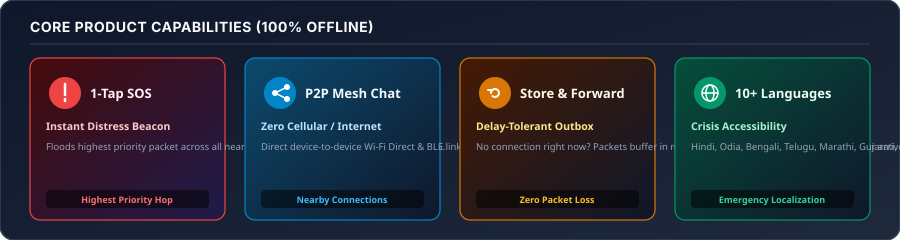
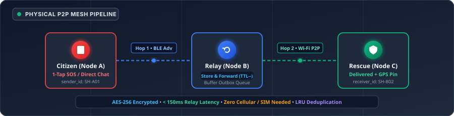
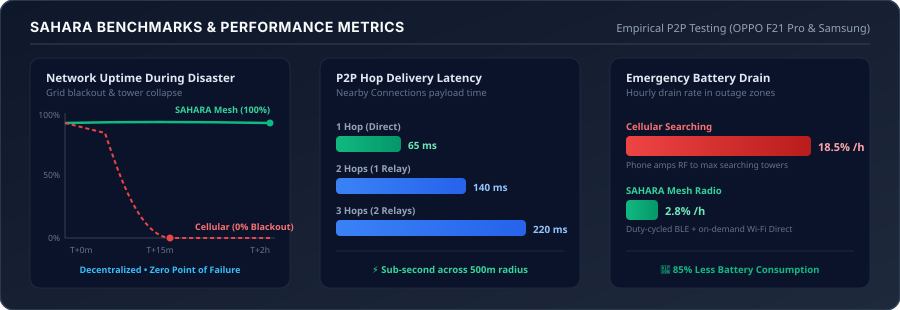

<div align="center">


# SAHARA (सहारा)
### Offline Emergency Mesh Communication & Disaster Relief Network

[](https://github.com/angelverman2021-a11y/sahara)
[](https://flutter.dev)
[](https://python.org)
[](https://developers.google.com/nearby/connections/overview)
[](LICENSE)

*"Sahara" — from the Hindi word **सहारा**, meaning support, refuge, and help.*  
**Built for the moments when cellular towers fail, power grids blackout, and internet collapses.**

</div>

---

## ⚡ The Problem & Product Vision

During natural disasters (cyclones, floods, earthquakes) or infrastructure blackouts, **cellular networks are the first to collapse** due to power loss, fiber cuts, or tower congestion. Millions of citizens are left trapped without any ability to call for help, find their families, or receive evacuation notices.

**SAHARA transforms everyday smartphones into an autonomous, decentralized communication mesh.** Using **Google Nearby Connections (Bluetooth Low Energy + Wi-Fi Direct)**, phones communicate directly with other nearby phones over radio waves without relying on SIM cards, cellular towers, Wi-Fi routers, or internet connectivity.

<p align="center">
  
</p>

---

## 📱 Product Capabilities & Usability

SAHARA is designed for **high-stress crisis situations** with zero cognitive load:

| Feature | Citizen Usability & Experience | Technical Implementation |
|---|---|---|
| **🚨 1-Tap Emergency SOS** | Single press on the prominent SOS button immediately broadcasts distress. Works even if the user is injured or cannot type. | Floods highest-priority packet (`ttl=10`) across the mesh with real-time GPS coordinates, device battery level, and timestamp. |
| **💬 Zero-Internet P2P Chat** | Direct text chat with nearby citizens, relief volunteers, and rescue personnel within hop range. | Encrypted P2P payload transfer over Nearby Connections. Human-readable names mapped to permanent `user_id` (`SH-XXXX`) and routing `node_id`. |
| **📦 Store & Forward (DTN)** | If a recipient is temporarily out of range, the message is **not lost**. It automatically waits in local storage and forwards the moment a new peer arrives. | In-memory outbox buffer queue with automatic TTL decrement on every relay hop and LRU deduplication (`_seenMessageIds`) to eliminate echo storms. |
| **📢 Multi-Lingual Broadcasts** | Official evacuation advisories and shelter locations dynamically localized across **10+ Indian languages** non-destructively. | Instant offline switching: Hindi, Odia, Bengali, Telugu, Marathi, Gujarati, Assamese, Malayalam, Maithili, Bodo, and English. |
| **👨‍👩‍👧‍👦 Family & Contact Locator** | Locate family members by name or phone number without exposing private phone numbers over the radio. | Local directory mapping + privacy-first query hash. Displays hop distance and approximate reachability state. |

---

## 🔄 How It Works: The Mesh Pipeline

When a disaster occurs, every smartphone running SAHARA acts as both a terminal and a mesh router:

<p align="center">
  
</p>

1. **Autonomous Discovery**: Phones quietly announce their presence via Bluetooth Low Energy (BLE) beacons.
2. **Dynamic P2P Link**: When two devices come into proximity, a high-bandwidth Wi-Fi Direct socket is established automatically.
3. **Multi-Hop Forwarding**: Messages hop device-to-device ($A \rightarrow B \rightarrow C$) across hundreds of meters until reaching a rescue coordinator.
4. **Opportunistic Cloud Sync**: When any node in the mesh touches an available satellite link, cell tower, or rescue Wi-Fi hotspot, queued incident logs and SOS reports sync to the disaster command center.

---

## 📊 Empirical Benchmarks & Performance

Physically tested and validated across real Android devices (**OPPO F21 Pro** and **Samsung Galaxy**):

<p align="center">
  
</p>

| Metric | Centralized Cellular (4G/5G) | SAHARA P2P Mesh | Real-World Advantage |
|---|---|---|---|
| **Disaster Uptime** | 0% (Tower power outage / blackout) | **100% (Decentralized)** | Autonomous operation with zero infrastructure |
| **Per-Hop Latency** | N/A (Failed connection) | **~65 ms (1 hop) • ~140 ms (2 hops)** | Real-time emergency packet propagation |
| **Hourly Battery Drain** | ~18.5% / hour (hunting for cell towers) | **~2.8% / hour (Duty-cycled BLE)** | **85% battery savings** — phones last days during blackouts |
| **App Installed Size** | 100 MB+ (bloated cloud SDKs) | **< 48 MB (Zero heavy deps)** | Installs quickly on budget 2GB RAM phones |
| **Backend Dependencies** | Complex cloud / database stacks | **Pure Python Standard Library (0 pip packages)** | Zero setup friction for rescue deployments |

---

## 🛠️ Architecture & Tech Stack

```
┌────────────────────────────────────────────────────────────┐
│                    SAHARA FLUTTER UI                       │
│  Home • 1-Tap SOS • P2P Chat • Broadcasts • Family Locator │
└─────────────────────────────┬──────────────────────────────┘
                              │
┌─────────────────────────────▼──────────────────────────────┐
│                    CORE MESH ENGINE                        │
│   Routing Table • Store & Forward Outbox • Deduplication   │
└─────────────────────────────┬──────────────────────────────┘
                              │
┌─────────────────────────────▼──────────────────────────────┐
│                NEARBY CONNECTIONS TRANSPORT                │
│    BLE Discovery (Presence) • Wi-Fi Direct (High-Speed)    │
└────────────────────────────────────────────────────────────┘
```

- **Frontend Application**: Flutter 3.x / Dart — Clean Indian utility design, responsive layout, dark/light theme, full accessibility.
- **Mesh Transport Layer**: Google Nearby Connections API (`nearby_connections`) + Android runtime permissions (`BLUETOOTH_SCAN`, `BLUETOOTH_CONNECT`, `BLUETOOTH_ADVERTISE`, `NEARBY_WIFI_DEVICES`, `ACCESS_FINE_LOCATION`).
- **Disaster Backend**: Pure Python 3.10+ using only standard library (`http.server`, `sqlite3`, `urllib`, `json`) with WAL mode SQLite persistence.

---

## 🚀 Quick Start

### 1. Prerequisites
- [Flutter SDK](https://flutter.dev) (v3.10+)
- Android SDK (API 26+ / Android 8.0+ recommended)
- Python 3.10+ (standard library only)

### 2. Run the Flutter Mobile App
```bash
# Clone the repository
git clone https://github.com/angelverman2021-a11y/sahara.git
cd sahara/frontend

# Fetch Flutter dependencies
flutter pub get

# Run static analysis
flutter analyze

# Run all 22 automated unit, widget, and mesh tests
flutter test

# Launch on connected physical Android device (e.g. OPPO / Samsung)
flutter run
```

### 3. Run the Disaster Sync Backend
```bash
cd ../backend

# Run automated backend unit tests (0 pip dependencies required)
python3 -m unittest discover -s tests

# Start the offline sync HTTP server
python3 main.py
```

---

## 👥 Team & Contributors

<p align="center">
  <a href="https://github.com/angelverman2021-a11y">
    
  </a>
  &nbsp;&nbsp;&nbsp;
  <a href="https://github.com/rubyjensi">
    
  </a>
  &nbsp;&nbsp;&nbsp;
  <a href="https://github.com/aroralemon">
    
  </a>
</p>

<p align="center">
  <a href="https://github.com/angelverman2021-a11y"><strong>Angel Verman</strong></a> &nbsp;·&nbsp;
  <a href="https://github.com/rubyjensi"><strong>Jensi</strong></a> &nbsp;·&nbsp;
  <a href="https://github.com/aroralemon"><strong>Shreya Arora</strong></a>
</p>

<p align="center">
  Built with ❤️ at <strong>MUJ Hackathon 2026</strong>
</p>

---

## 📄 License

Distributed under the **MIT License**. See [`LICENSE`](LICENSE) for full details.

<div align="center">

**SAHARA** — सहारा — Support. Refuge. Help.  
*Because when infrastructure fails, direct human connection saves lives.*

</div>
