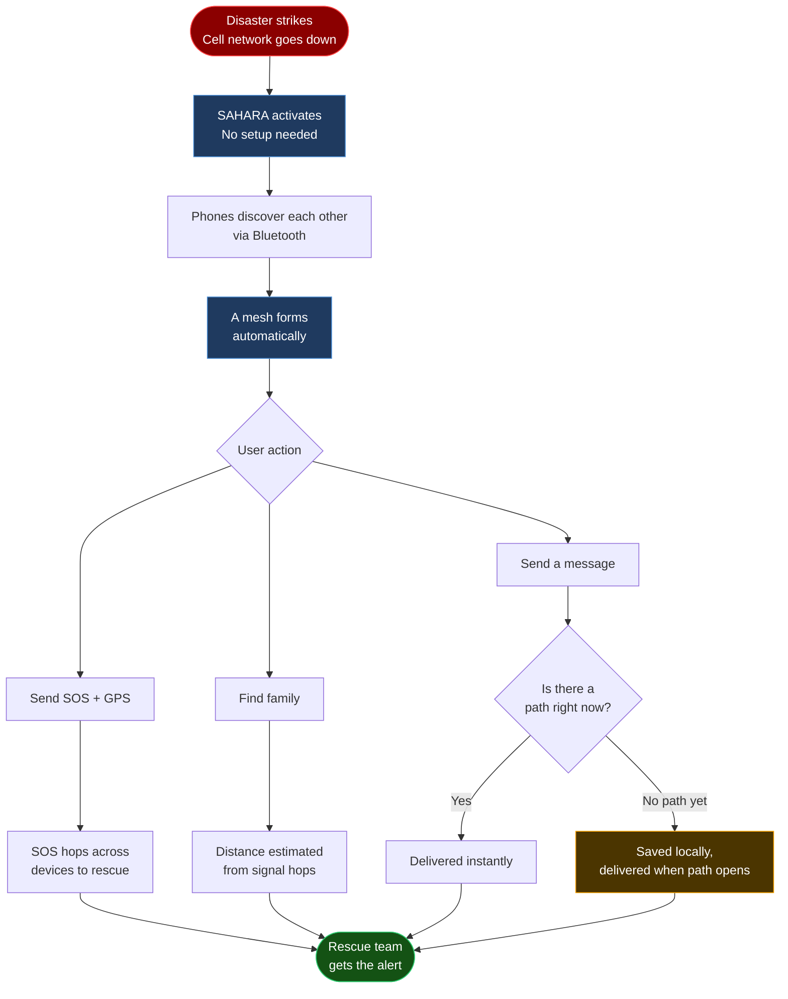
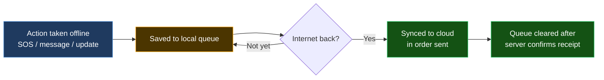

<div align="center">


# SAHARA — सहारा

**Offline Emergency Communication & Disaster Relief Network**

*From the Hindi सहारा — meaning support, refuge, and help.*

[](https://flutter.dev)
[](https://dart.dev)
[](https://python.org)
[](https://github.com/angelverman2021-a11y/sahara)

<br/>

**[Why It Exists](#the-problem--solution)** &nbsp;|&nbsp;
**[4 Features](#4-core-features)** &nbsp;|&nbsp;
**[How It Works](#how-it-works)** &nbsp;|&nbsp;
**[Tech Stack](#tech-stack)** &nbsp;|&nbsp;
**[Cloud Sync](#cloud-sync--api)** &nbsp;|&nbsp;
**[Quick Start](#quick-start)** &nbsp;|&nbsp;
**[Team](#contributors)**

</div>

---

## What is SAHARA?

When a disaster strikes, cell towers go down first — exactly when people need help most.

SAHARA turns every smartphone into a relay point. Phones talk directly to nearby phones, forming their own network without any tower, SIM card, or internet connection. An SOS sent from a trapped person hops from phone to phone until it reaches rescue teams — automatically, securely, and in any of 15+ languages.

> No signal? No problem. That's literally what we built this for.

---

## The Problem & Solution

```
WHAT GOES WRONG                          WHAT SAHARA DOES
────────────────────────                 ────────────────────────────────
Disaster hits                            Disaster hits
     │                                        │
Cell tower overloads                     SAHARA activates automatically
     │                                        │
Tower goes offline                       Your phone finds nearby phones
     │                                        │
No calls. No SMS.                        Messages hop phone → phone → phone
No location sharing.                          │
Rescue can't find you.                   Rescue team receives your GPS
```

| The Old Way | The SAHARA Way |
|---|---|
| Needs cell towers | Phones connect directly — no tower needed |
| One tower down = blackout | No single point of failure |
| Needs an active SIM + data plan | Works with no SIM, no data, no internet |
| Messages drop under congestion | Messages hop device-to-device until delivered |
| Location sharing needs internet | GPS coordinates sent over local device mesh |
| Carrier-level encryption only | End-to-end encrypted — always |
| High battery drain | Less than 5% battery overhead |

---

## 4 Core Features

All four work with **zero internet, zero SIM, zero cell signal.**

```
┌──────────────────────────────────────────────────────────────────────┐
│                                                                      │
│   EMERGENCY BROADCAST          OFFLINE COMMUNICATION                 │
│   ─────────────────────        ─────────────────────────             │
│   One tap. Your GPS            Encrypted messages travel             │
│   location + alert sent        phone to phone — no router,           │
│   to every SAHARA              no tower, no internet.                │
│   device nearby.                                                     │
│                                                                      │
│   SOS SIGNAL                   15+ LANGUAGES                         │
│   ──────────                   ─────────────                         │
│   A dedicated distress         Hindi, Tamil, Bengali,                │
│   signal that hops             Telugu, Marathi, Gujarati,            │
│   across the mesh              Kannada, Odia, Punjabi,               │
│   until it finds               Urdu, Malayalam, Assamese,            │
│   rescue — automatically.      Maithili, Santali, English            │
│                                                                      │
└──────────────────────────────────────────────────────────────────────┘
```

| Feature | What it does | Works offline? |
|---|---|---|
| **Emergency Broadcast** | One tap sends your GPS + distress alert to every SAHARA device nearby | Yes |
| **Offline Communication** | Encrypted chat hops phone-to-phone with zero internet | Yes |
| **SOS Signal** | Priority distress signal that self-routes to rescue teams | Yes |
| **15+ Languages** | Full app UI and alerts in 15+ Indian and international languages | Yes |

---

## How It Works

An SOS message travels from a trapped person to a rescue coordinator — through other people's phones, without anyone being able to read it.



**A few things worth knowing:**
- Relay phones forward messages without being able to read them — fully encrypted end-to-end
- If no path exists right now, the message is saved and sent the moment one appears *(we call this store-and-forward — no message is ever lost)*
- If a relay phone goes offline mid-route, the mesh reroutes automatically

---

## Tech Stack

> We kept it lean on purpose. The app must work on the cheapest Android phones in the country. **Target: under 50 MB, Android 8+, 2 GB RAM.**

**Mobile App**

| Technology | What it does | Version |
|---|---|---|
| Flutter | Builds the UI for Android and iOS from one codebase | 3.x |
| Dart | The language Flutter runs on | 3.x |
| SQLite | Stores messages locally when offline | Latest |
| flutter_map | Renders maps with no internet using downloaded tiles | Latest |

**Backend & Mesh Engine**

| Technology | What it does | Version |
|---|---|---|
| Python | Routing logic and disaster analytics on the server | 3.10+ |
| Bluetooth Low Energy | How phones find each other — a quiet "I'm here" beacon | Built-in |
| Wi-Fi Direct | How phones actually transfer data — no router needed | Built-in |
| WebSockets | Cloud sync when internet is briefly available | RFC 6455 |
| LoRa | Hardware add-on for 10km+ range in open areas | Hardware |

**Security**

| Technology | What it protects |
|---|---|
| AES-256 | Every message is encrypted — relay phones cannot read it |
| ECDH + X25519 | Unique keys per device pair — past messages stay private forever |

---

## Performance

| Metric | SAHARA | Standard SMS |
|---|---|---|
| Works when towers are down | Yes | No |
| Delivery time | Under 2 seconds per hop | Not available offline |
| Range | 200m Wi-Fi Direct / 10km+ LoRa | Tower dependent |
| Internet needed | None | 100% |
| Battery overhead | Less than 5% | Baseline |
| Encryption | End-to-end | Carrier-level only |
| App size | Under 50 MB | — |
| Min. Android | 8.0 | 4.4 |

---

## Cloud Sync & API

SAHARA is fully offline — but when internet returns (even for 30 seconds), it syncs everything automatically. No data gets left behind.



**API Endpoints**

| Method | Endpoint | Purpose | Offline? |
|---|---|---|---|
| POST | `/api/v1/sos` | SOS alert + GPS upload | Queued, syncs on reconnect |
| POST | `/api/v1/messages` | Mesh message upload | Queued, syncs on reconnect |
| POST | `/api/v1/analytics` | Disaster report data | Queued, syncs on reconnect |
| POST | `/api/v1/sync/queue` | Bulk queue upload | Triggered on reconnect |
| GET | `/api/v1/nodes` | Active rescue nodes nearby | Needs internet |
| GET | `/api/v1/family/{group_id}` | Family group locations | Needs internet |
| GET | `/api/v1/map/tiles/{z}/{x}/{y}` | Offline map tiles | Cached locally |

---

## Quick Start

**Prerequisites:** Flutter 3+, Dart 3+, Python 3.10+, Node.js 18+

```bash
git clone https://github.com/angelverman2021-a11y/sahara.git
cd sahara
npm install
pip install -r requirements.txt
flutter run
```

```bash
# Backend server
cd backend && python main.py
```

---

## Contributors

<p align="center">
  <a href="https://github.com/rubyjensi">
    
  </a>
  &nbsp;&nbsp;&nbsp;
  <a href="https://github.com/aroralemon">
    
  </a>
  &nbsp;&nbsp;&nbsp;
  <a href="https://github.com/shreyaarora">
    
  </a>
  <br/><br/>
  <a href="https://github.com/rubyjensi"><strong>Jensi</strong></a> &nbsp;·&nbsp;
  <a href="https://github.com/aroralemon"><strong>Shreya Arora</strong></a> &nbsp;·&nbsp;
  <a href="https://github.com/shreyaarora"><strong>Shreya</strong></a>
  <br/><br/>
  <em>Three women. One hackathon. Zero cell signal required.</em>
  <br/>
  Built with a lot of chai at <strong>MUJ Hackathon 2026</strong>
</p>

---

## Roadmap

- [x] P2P mesh messaging over Wi-Fi Direct + BLE
- [x] SOS beacon with live GPS broadcast
- [x] End-to-end encryption on all messages
- [x] Store-and-forward offline queue
- [x] Cloud sync with automatic retry
- [ ] LoRa hardware integration (long-range)
- [ ] 15+ language support — production ready
- [ ] Offline map tiles for disaster zones
- [ ] Family finding — production ready
- [ ] Rescue coordinator web dashboard

---

## License

MIT — see [`LICENSE`](LICENSE)

---

<p align="center">
  <strong>SAHARA — सहारा</strong><br/>
  <em>Support. Refuge. Help.</em><br/><br/>
  Because disasters don't wait — and neither do we.
</p>
