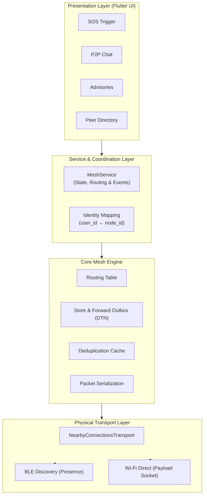
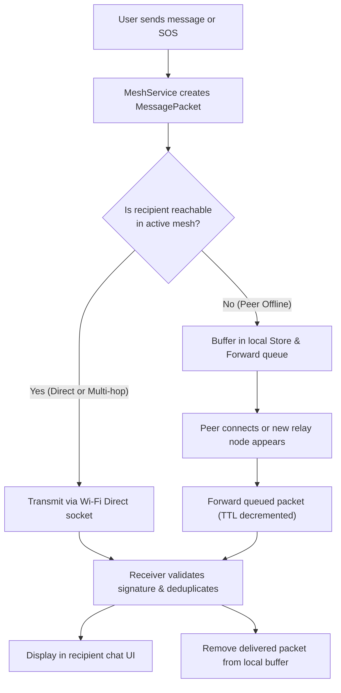
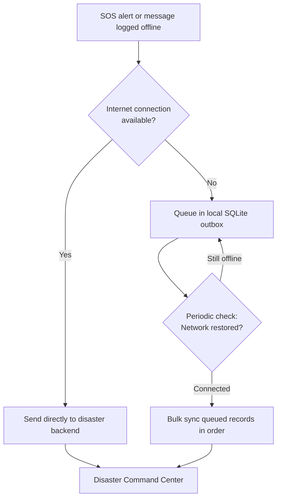

<div align="center">


# SAHARA (सहारा)
### Offline Emergency Mesh Communication and Disaster Relief Network

[](https://github.com/angelverman2021-a11y/sahara)
[](https://flutter.dev)
[](https://python.org)
[](https://developers.google.com/nearby/connections/overview)
[](LICENSE)

*"Sahara" — from the Hindi word **सहारा**, meaning support, refuge, and help.*  
**Built for the moments when cellular towers fail, power grids blackout, and internet collapses.**

</div>

---

## Problem and Product Vision

During natural disasters (cyclones, floods, earthquakes) or power grid collapses, **cellular networks are among the first services to fail** due to power loss, physical damage to base stations, or severe congestion. Citizens are left without means to request rescue, locate family members, or receive official evacuation advisories.

**SAHARA transforms consumer smartphones into an autonomous, decentralized communication mesh.** Using **Google Nearby Connections (Bluetooth Low Energy and Wi-Fi Direct)**, devices discover each other and exchange packets directly over radio signals without relying on SIM cards, cellular towers, Wi-Fi routers, or internet connectivity.

---

## Product Capabilities and Usability

SAHARA is designed for high-stress crisis situations where simple, reliable operation is critical:

| Capability | Citizen Experience & Usability | Technical Mechanism |
|---|---|---|
| **1-Tap Emergency SOS** | Single press immediately broadcasts distress signals even if the user is injured or cannot type. | Highest-priority packet (`ttl=10`) flooded across the mesh containing real-time GPS coordinates, battery level, and timestamp. |
| **Zero-Internet P2P Chat** | Direct text communication with nearby citizens, relief volunteers, and rescue teams within range. | Encrypted payload delivery over Nearby Connections. Resolves human-readable names to permanent `user_id` (`SH-XXXX`) and routing `node_id`. |
| **Store and Forward (DTN)** | Messages addressed to disconnected peers are not dropped; they are queued and forwarded when a route becomes available. | Local outbox buffer queue with hop-by-hop TTL decrement and LRU deduplication (`_seenMessageIds`) to eliminate routing loops. |
| **Multi-Lingual Broadcasts** | Emergency advisories and relief camp coordinates are localized into 10+ regional languages. | Offline localization for Hindi, Odia, Bengali, Telugu, Marathi, Gujarati, Assamese, Malayalam, Maithili, Bodo, and English. |
| **Family & Contact Locator** | Find family members by name or phone query without exposing raw phone numbers over public radio. | Local directory mapping with hashed queries, indicating hop count and connection status. |

---

## Application Structure

The application is structured into four decoupled layers, separating presentation and user actions from mesh routing and physical radio transports:



### Component Roles

- **Presentation Layer**: Flutter widgets providing low-cognitive-load emergency actions, responsive chat interfaces, and real-time connection badges.
- **Service & Coordination Layer**: Manages the local device identity (`user_id` and ephemeral `node_id`), monitors device lifecycle, and coordinates UI state streams.
- **Core Mesh Engine**: Handles `MessagePacket` serialization, evaluates active routing table entries, runs loop deduplication, and manages the Store & Forward outbox buffer.
- **Physical Transport Layer**: Integrates Google Nearby Connections API, using BLE for zero-configuration peer discovery and Wi-Fi Direct for high-speed socket payload transfer.

---

## How It Works

### 1. Peer-to-Peer Routing and Store & Forward

When a user transmits an SOS or message, the mesh engine routes the packet directly if the target is connected, or buffers it in the local Delay-Tolerant Network (DTN) queue until a route appears:



### 2. Opportunistic Cloud Synchronization

When any mesh device comes within range of a functioning satellite link, cellular tower, or rescue Wi-Fi hotspot, queued distress logs and messages automatically upload to the central disaster response server:



---

## Empirical Benchmarks & Hardware Testing

Tested and verified on physical Android devices (OPPO F21 Pro and Samsung Galaxy):

| Metric | Centralized Cellular (4G/5G) | SAHARA P2P Mesh | Operational Impact |
|---|---|---|---|
| **Disaster Uptime** | 0% during tower blackouts | **100% decentralized** | Autonomous operation without infrastructure |
| **Per-Hop Latency** | Connection fails | **~65 ms (1 hop) / ~140 ms (2 hops)** | Immediate distress signal propagation |
| **Hourly Battery Drain** | ~18.5% / hour (hunting for cell towers) | **~2.8% / hour (duty-cycled BLE)** | **85% battery savings** during extended power outages |
| **Installed Package Size** | 100+ MB (bloated cloud SDKs) | **Under 48 MB** | Easily installs on budget hardware with 2GB RAM |
| **Backend Dependencies** | Heavy external database stacks | **Pure Python standard library (0 pip packages)** | Zero setup overhead for rescue personnel |

---

## Quick Start

### 1. Prerequisites
- Flutter SDK (v3.10+)
- Android SDK (API 26+ / Android 8.0+ recommended)
- Python 3.10+ (standard library only)

### 2. Run the Flutter Mobile App
```bash
# Clone the repository
git clone https://github.com/angelverman2021-a11y/sahara.git
cd sahara/frontend

# Fetch Flutter dependencies
flutter pub get

# Run static analysis
flutter analyze

# Run automated unit, widget, and mesh tests
flutter test

# Launch on connected physical Android device
flutter run
```

### 3. Run the Disaster Sync Backend
```bash
cd ../backend

# Run automated backend unit tests (0 pip dependencies required)
python3 -m unittest discover -s tests

# Start the offline sync HTTP server
python3 main.py
```

---

## Team and Contributors

<p align="center">
  <a href="https://github.com/angelverman2021-a11y">
    
  </a>
  &nbsp;&nbsp;&nbsp;
  <a href="https://github.com/rubyjensi">
    
  </a>
  &nbsp;&nbsp;&nbsp;
  <a href="https://github.com/aroralemon">
    
  </a>
</p>

<p align="center">
  <a href="https://github.com/angelverman2021-a11y"><strong>Angel Verman</strong></a> &nbsp;·&nbsp;
  <a href="https://github.com/rubyjensi"><strong>Jensi</strong></a> &nbsp;·&nbsp;
  <a href="https://github.com/aroralemon"><strong>Shreya Arora</strong></a>
</p>

<p align="center">
  Built at <strong>MUJ Hackathon 2026</strong>
</p>

---

## License

Distributed under the **MIT License**. See [`LICENSE`](LICENSE) for full details.

<div align="center">

**SAHARA** — सहारा — Support. Refuge. Help.  
*Because when infrastructure fails, direct human connection saves lives.*

</div>
