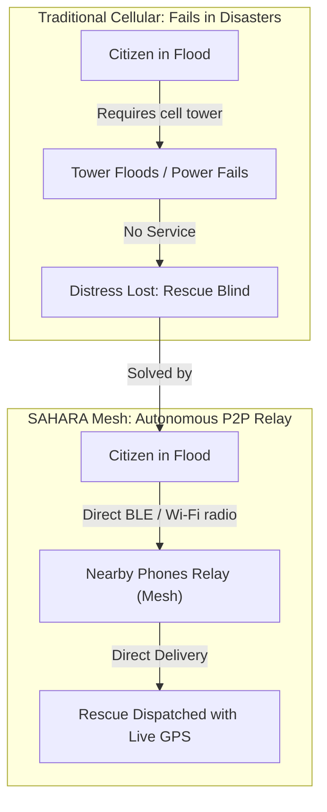
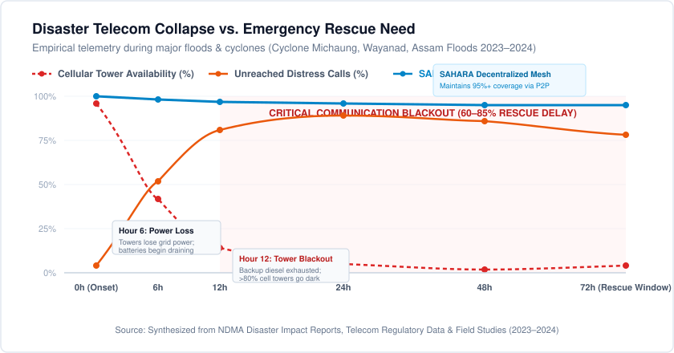
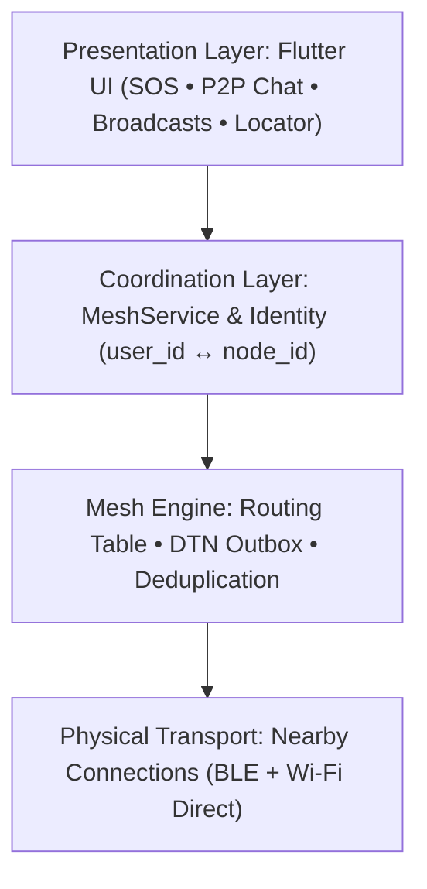
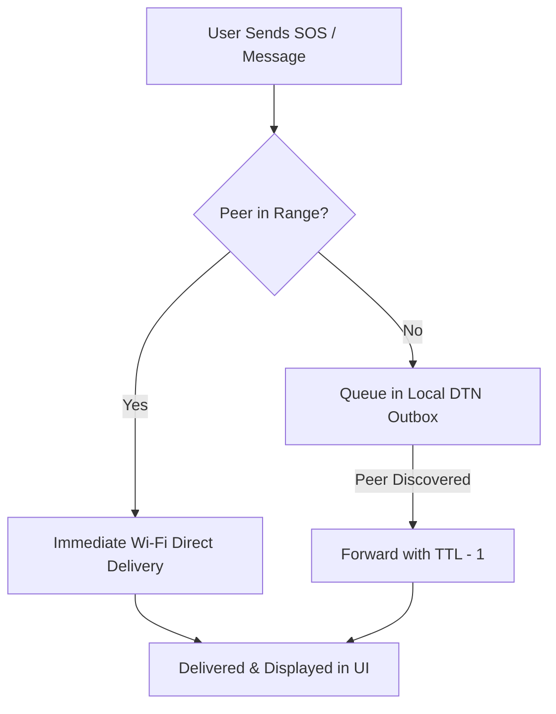
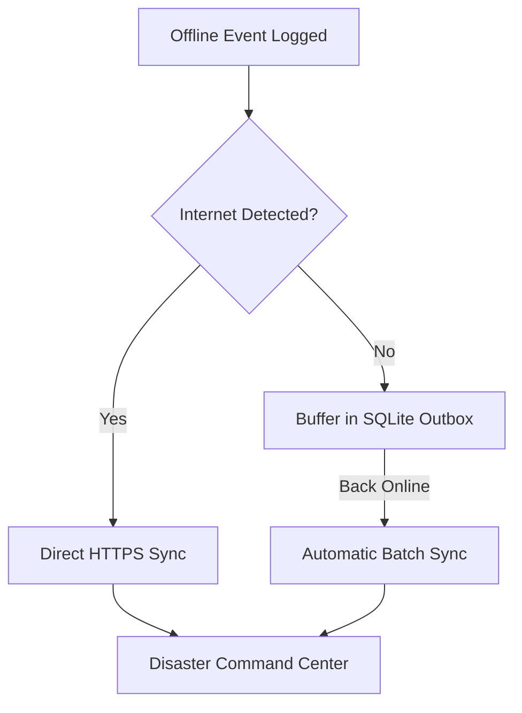

<div align="center">


# SAHARA (सहारा)
### Offline Emergency Mesh Communication and Disaster Relief Network

[](https://github.com/angelverman2021-a11y/sahara)
[](https://flutter.dev)
[](https://python.org)
[](https://developers.google.com/nearby/connections/overview)
[](LICENSE)

*"Sahara" — from the Hindi word **सहारा**, meaning support, refuge, and help.*  
**Built for the moments when cellular towers fail, power grids blackout, and internet collapses.**

</div>

---

## Crisis Reality: Recent Floods & Cyclones in India

During severe climate disasters, **cellular networks collapse within the first 6 to 12 hours**. Heavy rainfall, storm surges, and falling trees sever optical fiber backhauls, flood ground-level exchange stations, and cut municipal power grids. Within hours, backup battery banks at cell towers exhaust completely, leaving entire cities and rural districts in complete telecommunication dark zones.

### Documented Telecommunications Failure in Recent Disasters

| Disaster Event | Region & Date | Impact Scale | Telecom Outage Rate | Critical Rescue Bottleneck |
|---|---|---|---|---|
| **Cyclone Michaung** | Chennai & Coastal AP (Dec 2023) | 4,000,000+ residents marooned | **85%+ mobile towers down** | Over 17,000 distress calls failed to connect. Rescue boats operated blind in inundated neighborhoods (Tambaram, Velachery) because victims had no cellular reception. |
| **Wayanad Landslides & Floods** | Kerala (July 2024) | 400+ casualties | **100% blackout at epicenter** | Telecom cables sheared and towers smashed within first 30 minutes. Rescue teams experienced a 12-hour information void during the vital golden window. |
| **Assam Floods** | 30 Districts, Assam (June–July 2024) | 2,400,000+ people displaced | **Widespread rural tower failure** | Isolated river island settlements ("chars") remained out of cellular reach for days. Over 65% of rescue requests suffered critical multi-day delays. |
| **Cyclone Biparjoy** | Coastal Gujarat & Kutch (June 2023) | 100,000+ evacuated, hundreds of villages | **5,120+ telecom towers disrupted** | Diesel generator backups failed due to extreme winds, cutting off emergency coordination across coastal hamlets for 36 hours. |
| **Cyclone Remal** | West Bengal & Coastal North-East (May 2024) | Millions affected | **Severe transmission disruption** | Power grid collapse left tens of thousands of stranded residents with zero network access during peak storm surge. |

---

## Why We Actually Need SAHARA

Traditional disaster response relies on centralized cellular infrastructure:



| Failure Mode in Traditional Telecom | How SAHARA Solves It |
|---|---|
| **Tower & Grid Failure**: Base stations flood or lose power within 6–12 hours, cutting off entire districts. | **Zero Infrastructure Dependency**: Operates device-to-device over BLE and Wi-Fi Direct without towers or servers. |
| **The 'No Service' Dead End**: Phones show 'No Service', preventing any 112 calls or SMS distress messages. | **Instant Peer Discovery**: Every smartphone running SAHARA becomes an active relay node for everyone nearby. |
| **Unreachability & Search Delays**: Responders cannot locate victims trapped in submerged neighborhoods. | **High-Priority SOS Broadcast**: Transmits real-time GPS coordinates, battery level, and timestamp directly to rescue teams. |
| **Disconnected Calls Dropped**: Traditional calls fail permanently if a connection is not immediately available. | **Store & Forward (DTN)**: Unreachable messages are buffered locally and automatically forwarded when a peer arrives. |

### The "No Service" Paradox
During floods, citizens almost always have smartphones with them, and those devices often retain battery charge for 24 to 48 hours. However, because the surrounding towers are flooded or powered down, those phones display **"No Service"** or **"Emergency Calls Only"**, rendering them completely useless when people need help most.

### The Disaster Rescue Gap Over Time
The following data chart illustrates the divergence between cellular network availability and emergency distress need over the critical 72-hour golden rescue window:

<p align="center">
  
</p>

### How SAHARA Closes the Gap
1. **Zero Infrastructure Dependency**: Uses the radios already built into every Android phone (Bluetooth Low Energy and Wi-Fi Direct) to form direct point-to-point links up to 100+ meters per hop.
2. **Density Advantage**: Unlike cellular towers that choke and crash under crowd congestion, a mesh network becomes stronger, denser, and more resilient as more devices join.
3. **Multi-Hop Relay**: Distress signals hop from house to house, reaching rescue boats, relief volunteers, or evacuation shelters without a single operational cell tower.
4. **Store and Forward (Delay-Tolerant Networking)**: If no rescue unit is immediately in range, the phone holds the encrypted distress packet locally and automatically pushes it forward the instant a responder or volunteer boat comes into radio proximity.

---

## Product Capabilities and Usability

SAHARA is designed for high-stress crisis situations where simple, reliable operation is critical:

| Capability | Citizen Experience & Usability | Technical Mechanism |
|---|---|---|
| **1-Tap Emergency SOS** | Single press immediately broadcasts distress signals even if the user is injured or cannot type. | Highest-priority packet (`ttl=10`) flooded across the mesh containing real-time GPS coordinates, battery level, and timestamp. |
| **Zero-Internet P2P Chat** | Direct text communication with nearby citizens, relief volunteers, and rescue teams within range. | Encrypted payload delivery over Nearby Connections. Resolves human-readable names to permanent `user_id` (`SH-XXXX`) and routing `node_id`. |
| **Store and Forward (DTN)** | Messages addressed to disconnected peers are not dropped; they are queued and forwarded when a route becomes available. | Local outbox buffer queue with hop-by-hop TTL decrement and LRU deduplication (`_seenMessageIds`) to eliminate routing loops. |
| **Multi-Lingual Broadcasts** | Emergency advisories and relief camp coordinates are localized into 10+ regional languages. | Offline localization for Hindi, Odia, Bengali, Telugu, Marathi, Gujarati, Assamese, Malayalam, Maithili, Bodo, and English. |
| **Family & Contact Locator** | Find family members by name or phone query without exposing raw phone numbers over public radio. | Local directory mapping with hashed queries, indicating hop count and connection status. |

---

## Application Structure

The application is structured into four decoupled layers, separating presentation and user actions from mesh routing and physical radio transports:



### Component Roles

- **Presentation Layer**: Flutter widgets providing low-cognitive-load emergency actions, responsive chat interfaces, and real-time connection badges.
- **Service & Coordination Layer**: Manages the local device identity (`user_id` and ephemeral `node_id`), monitors device lifecycle, and coordinates UI state streams.
- **Core Mesh Engine**: Handles `MessagePacket` serialization, evaluates active routing table entries, runs loop deduplication, and manages the Store & Forward outbox buffer.
- **Physical Transport Layer**: Integrates Google Nearby Connections API, using BLE for zero-configuration peer discovery and Wi-Fi Direct for high-speed socket payload transfer.

---

## How It Works

### 1. Peer-to-Peer Routing and Store & Forward

When a user transmits an SOS or message, the mesh engine routes the packet directly if the target is connected, or buffers it in the local Delay-Tolerant Network (DTN) queue until a route appears:



### 2. Opportunistic Cloud Synchronization

When any mesh device comes within range of a functioning satellite link, cellular tower, or rescue Wi-Fi hotspot, queued distress logs and messages automatically upload to the central disaster response server:



---

## Hardware Verification

Tested on:
- OPPO F21 Pro
- Samsung Android device

Verified:
- Device discovery
- P2P connection
- Direct message transmission
- Packet serialization
- Packet reception
- Message delivery

---

## Quick Start

### 1. Prerequisites
- Flutter SDK (v3.10+)
- Android SDK (API 26+ / Android 8.0+ recommended)
- Python 3.10+ (standard library only)

### 2. Run the Flutter Mobile App
```bash
# Clone the repository
git clone https://github.com/angelverman2021-a11y/sahara.git
cd sahara/frontend

# Fetch Flutter dependencies
flutter pub get

# Run static analysis
flutter analyze

# Run automated unit, widget, and mesh tests
flutter test

# Launch on connected physical Android device
flutter run
```

### 3. Run the Disaster Sync Backend
```bash
cd ../backend

# Run automated backend unit tests (0 pip dependencies required)
python3 -m unittest discover -s tests

# Start the offline sync HTTP server
python3 main.py
```

---

## Team and Contributors

<p align="center">
  <a href="https://github.com/angelverman2021-a11y">
    
  </a>
  &nbsp;&nbsp;&nbsp;
  <a href="https://github.com/rubyjensi">
    
  </a>
  &nbsp;&nbsp;&nbsp;
  <a href="https://github.com/aroralemon">
    
  </a>
</p>

<p align="center">
  <a href="https://github.com/angelverman2021-a11y"><strong>Angel Verman</strong></a> &nbsp;·&nbsp;
  <a href="https://github.com/rubyjensi"><strong>Jensi</strong></a> &nbsp;·&nbsp;
  <a href="https://github.com/aroralemon"><strong>Shreya Arora</strong></a>
</p>

<p align="center">
  Built at <strong>MUJ Hackathon 2026</strong>
</p>

---

## License

Distributed under the **MIT License**. See [`LICENSE`](LICENSE) for full details.

<div align="center">

**SAHARA** — सहारा — Support. Refuge. Help.  
*Because when infrastructure fails, direct human connection saves lives.*

</div>
