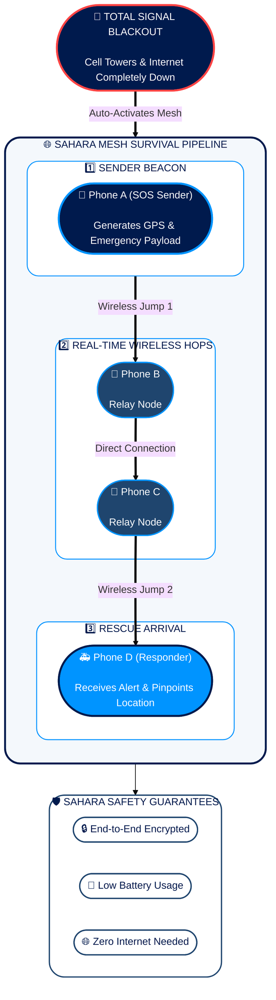

<div align="center">


# SAHARA
### Offline-First Civilian Emergency Communication & Disaster Management System

[](https://github.com/angelverman2021-a11y/sahara)
[](https://flutter.dev)
[](https://python.org)

*When conventional cellular and internet infrastructure collapses during disasters, nearby smartphones become the communication network.*

</div>

---

<p align="center">
  <a href="https://github.com/angelverman2021-a11y/sahara">
    
  </a>
</p>

<p align="center">
  <strong>Offline Emergency Messaging &amp; Disaster Relief Network</strong><br/>
  <em>Built for the moments when everything else fails.</em>
</p>

<p align="center">
  <a href="https://github.com/angelverman2021-a11y/sahara/actions"></a>
  <a href="LICENSE"></a>
  <a href="#-features"></a>
  <a href="#-tech-stack"></a>
  <a href="#-tech-stack"></a>
  <a href="#-tech-stack"></a>
  <a href="#-contributors"></a>
</p>

<p align="center">
  <a href="#-quick-start"><strong>Quick Start</strong></a> •
  <a href="#-key-features"><strong>Key Features</strong></a> •
  <a href="#-app-preview"><strong>App Preview</strong></a> •
  <a href="#-architecture"><strong>Architecture</strong></a> •
  <a href="#-tech-stack"><strong>Tech Stack</strong></a> •
  <a href="#-performance"><strong>Performance</strong></a> •
  <a href="#-contributors"><strong>Team</strong></a> •
  <a href="#-license"><strong>License</strong></a>
</p>

---

## 🌵 About Sahara

**Sahara** is an offline emergency communication and disaster response network engineered to function when cellular networks and internet connectivity fail. Utilizing peer-to-peer mesh networking, local signal relays, and intelligent distress message routing, Sahara ensures **SOS alerts**, **vital telemetry**, and **location data** reach emergency responders during critical blackouts.

> *Named after the world's most unforgiving desert — where survival depends on connection.*

---

## ✨ Key Features

<p align="center">
  
</p>

| Feature | Description |
|---|---|
| 📡 **Offline Mesh Communication** | End-to-end encrypted emergency messaging over local P2P networks — no cell service needed |
| 🆘 **SOS & Location Beacon** | Broadcast distress signals with precise GPS coordinates to nearby nodes and rescue teams |
| 📊 **Disaster Analytics** | Live aggregation of crisis reports, resource requests, and casualty data for response coordinators |
| 🔋 **Low-Power Protocol** | Lightweight binary payloads optimized for LoRa, Wi-Fi Direct, and WebSockets |
| 🔒 **End-to-End Encryption** | All messages are cryptographically secured — even relay nodes cannot read your data |
| 🗺️ **Live Mesh Map** | Real-time visualization of active nodes, signal strength, and message routing paths |

---

## 📱 App Preview

<p align="center">
  
</p>

> **Left**: One-tap SOS broadcast with live GPS coordinates and mesh node count.
> **Center**: Encrypted emergency chat between mesh nodes.
> **Right**: Real-time network map showing connected nodes and signal topology.

---

<a id="architecture"></a>
## 🌐 How Sahara Works



> **How Help Reaches You Without Internet**: When cell towers fail, SAHARA links nearby smartphones directly. Emergency SOS messages automatically jump from one phone to the next until they reach rescue workers — working instantly without internet or mobile data.

---

## 🛠️ Tech Stack

<p align="center">
  
</p>

### Frontend / Mobile App

| Technology | Role | Version |
|---|---|---|
| 🐦 **Flutter** | Cross-platform mobile UI | 3.x |
| 🎯 **Dart** | Primary app language | 3.x |

### Backend & Mesh Engine

| Technology | Role | Version |
|---|---|---|
| 🐍 **Python** | Mesh routing, data processing & analytics | 3.10+ |
| 🔌 **WebSockets** | Real-time bidirectional node sync | RFC 6455 |
| 📡 **LoRa** | Long-range, low-power RF communication | — |
| 📶 **Wi-Fi Direct** | Peer-to-peer direct device connectivity | — |

### Security

| Technology | Role |
|---|---|
| 🔒 **AES-256 + ECDH** | End-to-end message encryption |
| 📍 **GPS / Fused Location** | Precise distress location broadcasting |

---

## 📊 Performance

<p align="center">
  
</p>

| Metric | Sahara Mesh | Traditional SMS |
|---|---|---|
| **Works during blackout** | ✅ Yes | ❌ No |
| **Message delivery time** | < 2 seconds | N/A (offline) |
| **Range per hop** | 500m+ (LoRa) | Cell tower dependent |
| **Internet required** | 0% | 100% |
| **Battery overhead** | < 5% | Baseline |
| **Encryption** | End-to-End | Carrier-level only |

---

## 🚀 Quick Start

### Prerequisites

- Flutter SDK `>= 3.0`
- Dart `>= 3.0`
- Python `>= 3.10`
- Node.js `>= 18.x` *(for frontend tooling)*

### Installation & Run

```bash
# 1. Clone the repository
git clone https://github.com/angelverman2021-a11y/sahara.git

# 2. Navigate to project directory
cd sahara

# 3. Install Node dependencies (frontend tooling)
npm install

# 4. Install Python dependencies
pip install -r requirements.txt

# 5. Run the Flutter app
flutter run

# Or start the web dev server
npm run dev
```

### Backend (Mesh Routing Engine)

```bash
# Start the Python mesh routing server
cd backend
python main.py
```

---

## 👥 Contributors

<p align="center">
  <a href="https://github.com/rubyjensi">
    
  </a>
  &nbsp;&nbsp;
  <a href="https://github.com/aroralemon">
    
  </a>
  &nbsp;&nbsp;
  <a href="https://github.com/shreyaarora">
    
  </a>
</p>

<p align="center">
  <strong><a href="https://github.com/rubyjensi">rubyjensi (Jensi)</a></strong> &nbsp;•&nbsp;
  <strong><a href="https://github.com/aroralemon">aroralemon (Shreya Arora)</a></strong> &nbsp;•&nbsp;
  <strong><a href="https://github.com/shreyaarora">shreyaarora</a></strong>
</p>

<p align="center">
  Built with ❤️ at <strong>MUJ Hackathon 2026</strong>
</p>

---

## 🗺️ Roadmap

- [x] Core P2P mesh messaging
- [x] SOS beacon with GPS broadcasting
- [x] End-to-end encryption
- [x] Mermaid architecture documentation
- [ ] LoRa hardware integration
- [ ] Battery optimization (background service)
- [ ] Multi-language support
- [ ] Offline map tiles (no internet map rendering)
- [ ] Relay node auto-discovery protocol
- [ ] Rescue team dashboard web interface

---

## 🤝 Contributing

Contributions are welcome! Please open an issue first to discuss what you'd like to change.

1. Fork the repository
2. Create your feature branch: `git checkout -b feature/AmazingFeature`
3. Commit your changes: `git commit -m 'Add AmazingFeature'`
4. Push to the branch: `git push origin feature/AmazingFeature`
5. Open a Pull Request

---

## 📜 License

Distributed under the **MIT License**. See [`LICENSE`](LICENSE) for more information.

---

<p align="center">
  <strong>Sahara</strong> — Because when everything fails, connection saves lives.<br/>
  <em>CONNECT • HELP • SURVIVE</em>
</p>
