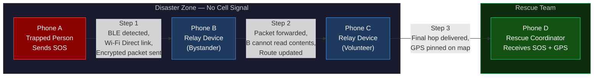
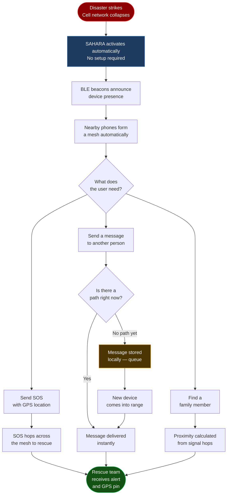
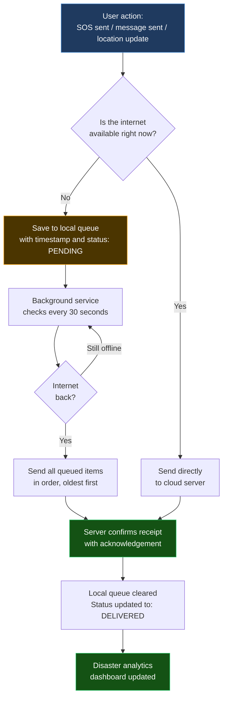

<div align="center">


# SAHARA

### Offline Emergency Communication & Disaster Relief Network

[](https://github.com/angelverman2021-a11y/sahara)
[](https://flutter.dev)
[](https://python.org)

*"Sahara" — from the Hindi word **सहारा**, meaning support, refuge, and help.*
*Built for the moments when everything else fails.*

</div>

---

<p align="center">
  <a href="https://github.com/angelverman2021-a11y/sahara">
    
  </a>
</p>

<p align="center">
  <a href="https://github.com/angelverman2021-a11y/sahara/actions"></a>
  <a href="LICENSE"></a>
  <a href="#the-problem--our-solution"></a>
  <a href="#tech-stack--size-strategy"></a>
  <a href="#tech-stack--size-strategy"></a>
  <a href="#tech-stack--size-strategy"></a>
  <a href="#contributors"></a>
</p>

<p align="center">
  <a href="#the-problem--our-solution"><strong>Why It Exists</strong></a> &nbsp;|&nbsp;
  <a href="#what-sahara-does"><strong>What It Does</strong></a> &nbsp;|&nbsp;
  <a href="#how-it-works"><strong>How It Works</strong></a> &nbsp;|&nbsp;
  <a href="#app-features-in-plain-english"><strong>Features</strong></a> &nbsp;|&nbsp;
  <a href="#tech-stack--size-strategy"><strong>Tech Stack</strong></a> &nbsp;|&nbsp;
  <a href="#cloud-sync--api"><strong>Cloud Sync</strong></a> &nbsp;|&nbsp;
  <a href="#quick-start"><strong>Quick Start</strong></a> &nbsp;|&nbsp;
  <a href="#contributors"><strong>Team</strong></a>
</p>

---

## About SAHARA

SAHARA is an emergency communication system designed for one specific scenario: **when mobile networks and the internet go down during a disaster.**

During floods, earthquakes, or large-scale blackouts, the first infrastructure to collapse is the cellular network — precisely when people need to call for help the most. SAHARA solves this by turning every smartphone into a small communication tower. Phones talk directly to other nearby phones, and messages hop from device to device until they reach rescue teams — no SIM card, no Wi-Fi, no internet required.

> **The name**: "Sahara" comes from the Hindi word **सहारा** — meaning *support*, *refuge*, and *help*. It is also the world's most unforgiving desert, where survival depends entirely on connection. Both meanings apply.

---

## Four Things SAHARA Does That Nothing Else Can

These are the four core features of the app — all of them work with **zero internet, zero SIM card, and zero cell signal.**

```
┌─────────────────────────────────────────────────────────────────────────────────┐
│                                                                                 │
│   EMERGENCY BROADCAST         OFFLINE COMMUNICATION                             │
│   ────────────────────        ────────────────────────                          │
│   Send an alert to every      Chat with rescue teams,                           │
│   person within range —       family, and volunteers                            │
│   instantly, automatically,   using only the phones                             │
│   with your GPS location      around you as a network                           │
│   attached. No tapping        — no router, no tower,                            │
│   around menus. One press.    no internet needed.                               │
│                                                                                 │
│   SOS SIGNAL                  15+ LANGUAGES                                     │
│   ──────────                  ─────────────                                     │
│   A dedicated distress        SAHARA works in Hindi,                            │
│   signal that travels         Tamil, Bengali, Telugu,                           │
│   across the entire           Marathi, Gujarati,                                │
│   device mesh until it        Kannada, Odia, Punjabi,                           │
│   reaches a rescue            Urdu, Malayalam, Assamese,                        │
│   coordinator — even if       Maithili, Santali, English                        │
│   you cannot speak or         and more — so no one is                           │
│   type a message.             left behind in a crisis.                          │
│                                                                                 │
└─────────────────────────────────────────────────────────────────────────────────┘
```

| Feature | What it means for you |
|---|---|
| **Emergency Broadcast** | One tap sends your location and a distress alert to every phone nearby — they don't need to be your contacts |
| **Offline Communication** | Text messages travel phone-to-phone like a chain, reaching people hundreds of metres away with no internet |
| **SOS Signal** | A dedicated panic signal — louder and more urgent than a regular message — that prioritises its own delivery across the mesh |
| **15+ Languages** | The app interface and alerts are available in over 15 Indian and international languages, including all major regional languages |

---

## The Problem & Our Solution

Most emergency systems depend on centralized infrastructure — cell towers, internet servers, power grids. These are exactly the things that collapse in a disaster.

```
WHAT HAPPENS WHEN A DISASTER STRIKES
─────────────────────────────────────────────────────────────────────────

  Cell tower         Cell tower         Cell tower
  overloaded    ──►  goes offline  ──►  area blacked out
      │                  │                    │
      ▼                  ▼                    ▼
  Calls drop        SMS fails          No location sharing
  Internet gone     No emergency       Rescue cannot find you
                    alerts

  RESULT: People who need help cannot ask for it.
          Rescue teams cannot coordinate.
          Families cannot find each other.

─────────────────────────────────────────────────────────────────────────

  WHAT SAHARA DOES INSTEAD

  Your phone ──► Nearby phone ──► Another phone ──► Rescue team
                  (relay)             (relay)

  No tower needed. No internet needed. No SIM required.
  Phones form their own network — automatically.

─────────────────────────────────────────────────────────────────────────
```

| The Problem with Normal Networks | How SAHARA is Different |
|---|---|
| Relies on cell towers that can be destroyed | No towers needed — phones connect directly to each other |
| One tower failure = entire area goes dark | Every phone is a node — losing one changes nothing |
| Requires an active data or SIM plan | Works with no SIM, no data, no internet |
| Messages fail when networks are congested | Messages hop device-to-device until they arrive |
| Your location cannot be shared without data | GPS coordinates broadcast over local device mesh |
| Rescue coordination collapses without internet | Disaster data collected locally and synced when possible |
| No encryption during carrier outages | Every message is end-to-end encrypted, always |
| High battery drain during emergencies | Designed for low battery consumption from day one |

---

## What SAHARA Does

SAHARA has four core features, each built to work with zero connectivity:

**SOS Beacon** — Press one button to broadcast your exact location and a distress signal to every SAHARA device within range. The signal jumps from phone to phone until it reaches someone who can help.

**Emergency Chat** — Send text messages across the device mesh. Messages travel through relay phones to reach their destination. Neither the relay phones nor any server can read your messages.

**Store and Forward** — If there is no path to your recipient right now, your message is saved locally. The moment a new device comes into range and creates a path, your message is forwarded automatically. Nothing is lost.

**Family Finding** — Each device broadcasts a silent identifier. If your family members have SAHARA installed, you will see their approximate direction and distance on your screen — even with no internet.

---

## How It Works

### The Simple Version

Think of SAHARA like passing a note in a classroom. If you cannot reach someone directly, you pass it to the person next to you, who passes it to the next person, until it arrives. Each person only knows who handed it to them and who to pass it to next — they cannot read it.

SAHARA does this with phones, wirelessly, automatically, and with encryption so no relay phone can read the message.

---

### How Phones Find Each Other

SAHARA uses two wireless technologies that are built into every modern Android phone:

**Bluetooth Low Energy (BLE)** — A short-range, very low power signal that each phone broadcasts constantly. Think of it like a phone quietly announcing "I am here" every few seconds. Other SAHARA phones hear this and know a device is nearby.

**Wi-Fi Direct** — Once two phones know each other is nearby (via BLE), they switch to Wi-Fi Direct to actually transfer messages. This is faster and handles larger payloads. No Wi-Fi router is needed — the phones connect directly to each other.

```
DEVICE DISCOVERY — HOW TWO PHONES FIND EACH OTHER

  ┌─────────────┐                         ┌─────────────┐
  │   Phone A   │                         │   Phone B   │
  │             │                         │             │
  │  BLE beacon │ ──── "I am here" ────►  │  Hears A    │
  │  (always on)│                         │             │
  │             │ ◄─── "I am here" ─────  │  BLE beacon │
  │  Hears B    │                         │  (always on)│
  └──────┬──────┘                         └──────┬──────┘
         │                                        │
         │    Both phones now know each other     │
         │                                        │
         └──────── Wi-Fi Direct handshake ────────┘
                   Messages can now transfer
                   at full speed, encrypted
```

---

### How a Message Travels Across the Mesh

This is the full journey of a single SOS message from a trapped person to a rescue worker:



**What each relay phone does:**
- Receives an encrypted packet
- Checks its routing table to find the best next hop
- Forwards the packet without being able to read it
- Updates the mesh map with the new route information

**What happens if a relay phone goes offline:** The mesh automatically reroutes through any other available device. There is no single point of failure.

---

### The Full System Pipeline



---

## App Features in Plain English

### SOS Beacon

| What it does | How to use it | What the rescue team sees |
|---|---|---|
| Sends your GPS location and a distress signal to every device within range | Press the large red SOS button once | Your exact location pinned on a map, your battery level, and the time the signal was sent |

The signal does not stop at the first device it reaches. It continues hopping across every available phone in the mesh until it reaches someone who can act on it.

---

### Emergency Chat

| What it does | How it is different from a normal text |
|---|---|
| Sends encrypted messages across the device mesh | No SIM card needed. No internet. The message travels through other people's phones without them being able to read it. |

Think of it as a secure walkie-talkie that can stretch across an entire city by bouncing through other phones.

---

### Store and Forward

This is the most important feature for disconnected situations.

```
NORMAL MESSAGING — requires a live connection
──────────────────────────────────────────────
  You ──── message ────► [NO PATH] ──► Message lost

SAHARA STORE AND FORWARD
──────────────────────────────────────────────
  You send message ──► No path exists right now
                            │
                            ▼
                       Saved locally
                            │
               (30 minutes later — new device nearby)
                            │
                            ▼
                       Message forwarded ──► Delivered
```

No message is ever lost. It waits until a path exists, then delivers itself.

---

### Family Finding

```
HOW FAMILY FINDING WORKS

  Your phone broadcasts a quiet, encrypted family ID every 5 seconds
                         │
                         ▼
  Other SAHARA phones relay this ID across the mesh
                         │
                         ▼
  Your family member's phone picks it up
                         │
                         ▼
  App shows: "Your brother — approx. 400m away — last seen 2 min ago"

  No GPS required for family finding — uses signal hop count to estimate distance.
```

---

## Tech Stack & Size Strategy

### Why Size Matters

SAHARA is built for emergencies. That means it must work on older, cheaper phones with limited storage and battery. The target is any Android phone running Android 8 or newer with at least 2GB of RAM — which covers the vast majority of phones in use across India today.

**Strict rule: the app must remain under 50 MB installed.**

```
SAHARA SIZE BUDGET
──────────────────────────────────────────
  Flutter UI framework        ~12 MB
  Dart runtime                 ~8 MB
  Mesh networking layer         ~5 MB
  Encryption library            ~2 MB
  Offline map tiles            ~10 MB
  App logic and assets          ~8 MB
  Safety buffer                 ~5 MB
  ─────────────────────────────────────
  Total target                < 50 MB
──────────────────────────────────────────
```

**What we deliberately excluded to keep it small:**
- No Firebase or cloud SDK on the device
- No analytics or tracking libraries
- No machine learning models
- No advertising frameworks
- Messages encoded in compact binary format, not text-heavy JSON
- Map tiles compressed and limited to high-risk regions only

---

### Technology Used

**Mobile App**

| Technology | What it does | Version |
|---|---|---|
| Flutter | Builds the visual interface for both Android and iOS from one codebase | 3.x |
| Dart | The programming language Flutter uses | 3.x |
| SQLite | Stores messages locally when offline | Latest |
| flutter_map | Renders maps without internet using downloaded tiles | Latest |

**Backend and Mesh Engine**

| Technology | What it does | Version |
|---|---|---|
| Python | Runs the routing logic and analytics on the server side | 3.10+ |
| WebSockets | Keeps the server and app in sync when internet is available | RFC 6455 |
| Wi-Fi Direct | Connects phones directly to each other without a router | Android built-in |
| Bluetooth Low Energy | Discovers nearby devices and announces presence | Android built-in |
| LoRa | Long-range, low-power radio for hardware-extended range | Hardware add-on |

**Security**

| Technology | What it protects |
|---|---|
| AES-256 | Encrypts every message so relay phones cannot read it |
| ECDH Key Exchange | Creates a unique encryption key between every pair of devices |
| X25519 | Ensures that even if one session is compromised, past messages remain private |

---

## Performance

| What we measured | SAHARA | Standard SMS |
|---|---|---|
| Works when cell towers are down | Yes | No |
| Message delivery time | Under 2 seconds per hop | Not available offline |
| Range between two phones | Up to 200m (Wi-Fi Direct), 10km+ with LoRa hardware | Requires tower |
| Internet required | None | 100% |
| Battery usage overhead | Less than 5% | Standard baseline |
| Encryption | End-to-end — no one in the middle can read it | Carrier-level only |
| Installed app size | Under 50 MB | Not applicable |
| Minimum Android version | Android 8.0 | Android 4.4 |

---

## Cloud Sync & API

SAHARA works completely offline. However, when an internet connection becomes available — even briefly — it automatically syncs everything that happened during the outage to the cloud. This gives disaster coordinators a full picture of what occurred.

### How the Sync Works



### API Endpoints

| Method | Endpoint | What it does | Offline behaviour |
|---|---|---|---|
| POST | `/api/v1/sos` | Upload SOS alert with GPS coordinates | Queued locally, syncs on reconnect |
| POST | `/api/v1/messages` | Upload stored mesh messages | Queued locally, syncs on reconnect |
| POST | `/api/v1/analytics` | Push disaster report summary | Queued locally, syncs on reconnect |
| POST | `/api/v1/sync/queue` | Bulk upload entire offline queue | Triggered on reconnect |
| GET | `/api/v1/nodes` | Fetch list of active rescue nodes nearby | Requires internet |
| GET | `/api/v1/family/{group_id}` | Resolve family group locations from cloud | Requires internet |
| GET | `/api/v1/map/tiles/{z}/{x}/{y}` | Download offline map tiles | Cached locally in advance |

### Retry Logic

If a sync attempt fails, the app retries with increasing wait times to avoid overloading a recovering network:

```
First retry:   1 second wait
Second retry:  2 seconds wait
Third retry:   4 seconds wait
Fourth retry:  8 seconds wait
...
Maximum wait:  60 seconds between retries

Messages are never deleted from the local queue until
the server confirms it received them.
```

---

## Quick Start

### What You Need Before Starting

- Flutter SDK version 3.0 or above
- Dart version 3.0 or above
- Python version 3.10 or above
- Node.js version 18 or above

### Setup

```bash
# Clone the project
git clone https://github.com/angelverman2021-a11y/sahara.git
cd sahara

# Install frontend dependencies
npm install

# Install Python dependencies
pip install -r requirements.txt

# Run the app on a connected Android device
flutter run

# Or start the web preview
npm run dev
```

### Start the Backend Server

```bash
cd backend
python main.py
```

---

## Contributors

<p align="center">
  <a href="https://github.com/rubyjensi">
    
  </a>
  &nbsp;&nbsp;&nbsp;
  <a href="https://github.com/aroralemon">
    
  </a>
  &nbsp;&nbsp;&nbsp;
  <a href="https://github.com/shreyaarora">
    
  </a>
</p>

<p align="center">
  <a href="https://github.com/rubyjensi"><strong>Jensi</strong></a> &nbsp;·&nbsp;
  <a href="https://github.com/aroralemon"><strong>Shreya Arora</strong></a> &nbsp;·&nbsp;
  <a href="https://github.com/shreyaarora"><strong>Shreya</strong></a>
</p>

<p align="center">
  Built at <strong>MUJ Hackathon 2026</strong>
</p>

---

## Roadmap

- [x] Core P2P mesh messaging over Wi-Fi Direct and BLE
- [x] SOS beacon with live GPS broadcasting
- [x] End-to-end encryption on all messages
- [x] Store-and-forward queue for disconnected delivery
- [x] Architecture and flow documentation
- [x] Problem vs solution comparison
- [x] Cloud sync queue with retry logic
- [ ] LoRa hardware integration for extended range
- [ ] Background battery optimization service
- [ ] Multi-language support (Hindi, Tamil, Bengali, Telugu)
- [ ] Offline map tiles for high-risk zones
- [ ] Relay node auto-discovery protocol
- [ ] Rescue coordinator web dashboard
- [ ] Family finding proximity (production-ready)

---

## Contributing

Contributions are welcome. Please open an issue first to discuss what you would like to change.

1. Fork the repository
2. Create your feature branch: `git checkout -b feature/your-feature`
3. Commit your changes: `git commit -m 'Add your feature'`
4. Push to the branch: `git push origin feature/your-feature`
5. Open a Pull Request

---

## License

Distributed under the **MIT License**. See [`LICENSE`](LICENSE) for details.

---

<p align="center">
  <strong>SAHARA</strong> — सहारा — Support. Refuge. Help.<br/>
  <em>Because when everything fails, connection saves lives.</em>
</p>
